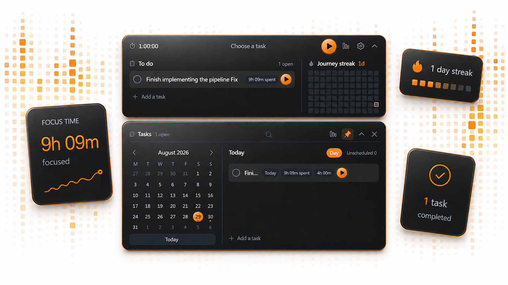
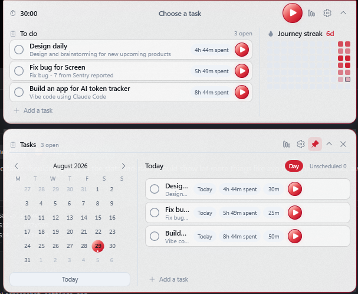
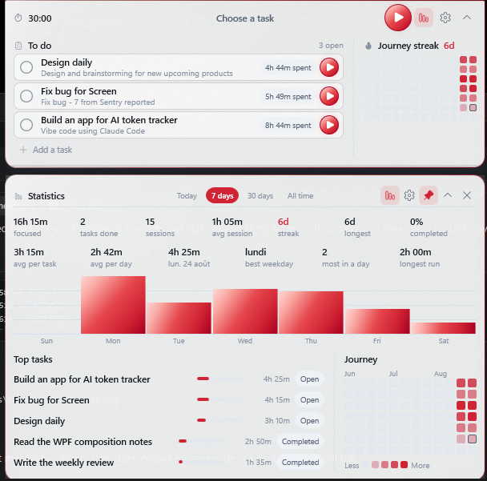
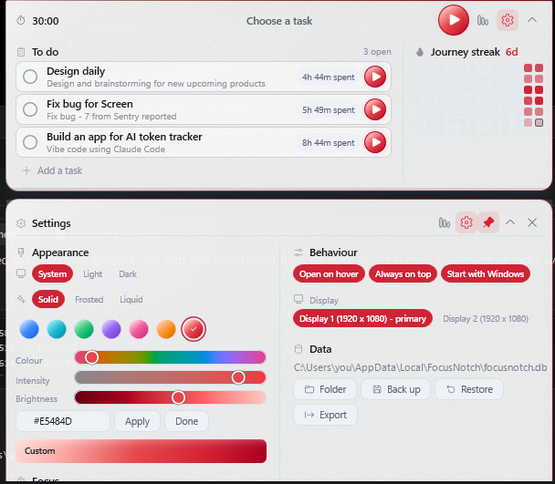

<p align="center">
  
</p>

<h1 align="center">Counter</h1>

<p align="center">
  <b>A focus timer and task planner that lives in a notch at the top of your screen.</b><br>
  It counts the time you actually spent, not the time you meant to spend.
</p>

<p align="center">
  <a href="https://github.com/makswinz/Counter/actions/workflows/ci.yml"></a>
  <a href="https://github.com/makswinz/Counter/releases/latest"></a>
  <a href="https://github.com/makswinz/Counter/releases/latest"></a>
  <a href="LICENSE"></a>
  
  
</p>

<p align="center">
  <a href="#install"><b>Download</b></a> &nbsp;&middot;&nbsp;
  <a href="#what-it-does">What it does</a> &nbsp;&middot;&nbsp;
  <a href="#build-it-yourself">Build it</a> &nbsp;&middot;&nbsp;
  <a href="docs/DESIGN.md">How it is built</a>
</p>

<p align="center">
  
</p>

---

## What it does

It behaves like a hardware notch. Normally it is a thin bar at the exact centre of your top screen
edge showing the countdown and the active task. Hover and it unfolds into a quick panel, then a
full planner with a calendar and a duration picker, then a statistics surface.

| | |
| --- | --- |
| **Measures, does not estimate** | Every stretch of a running session is stored as a pair of instants. Every total on screen is added up from those, so pausing for lunch does not quietly become an hour of focus. Sessions that cross midnight are split and land on both days. |
| **Statistics that say something** | Not just how much, but how it was spread: time per task, time per day you actually worked, your best day, your busiest weekday, the day you finished the most, and your longest unbroken run. |
| **Any accent colour you like** | Pick a colour and the whole palette is derived from it in OKLCH: five lit gradient stops, the contour, the halo, the tint, and a foreground chosen by measuring contrast rather than by guessing. Six presets, or mix your own. |
| **Real glass** | Three materials. The two translucent ones are backed by a genuine compositor blur, which on a layered window takes some doing. |
| **Never in the way** | The window never changes width, so opening a panel cannot make anything jump sideways. Everything outside the card passes clicks straight through to what is underneath. |
| **Yours** | Local SQLite. No account, no cloud service, no subscription, no API key, no telemetry, no network calls at all. Rotating local backups, and CSV export whenever you want out. |

<p align="center">
  
</p>

<p align="center">
  
</p>

<p align="center">
  
</p>

<p align="center">
  
</p>

**Stack:** C#, .NET 8, WPF, MVVM (`CommunityToolkit.Mvvm`), `Microsoft.Data.Sqlite`, xUnit.
Targets `net8.0-windows10.0.19041.0`; Windows 10 build 19041 or newer, Windows 11 as the primary
visual target. Runs as the invoking user, and never asks for administrator rights.

---

## Install

**[Download the latest release](https://github.com/makswinz/Counter/releases/latest)**, then
pick one:

| | |
| --- | --- |
| `Counter-Setup-x.y.z.exe` | The installer. Puts it in the Start menu, offers a desktop shortcut, and adds an entry to Add or remove programs. Installs under your own user account, so it needs no administrator rights. |
| `Counter-x.y.z-portable.exe` | One file. Put it anywhere and run it. Nothing is installed. |

Both are self-contained: **.NET does not need to be installed.** Windows 10 build 17763 or newer,
64-bit.

> **Windows will warn you the first time.** The download is not signed with a code-signing
> certificate, so SmartScreen shows "Windows protected your PC". Click **More info**, then **Run
> anyway**. This is what an unsigned executable from a small project looks like; if that is not
> acceptable to you, build it yourself from source with the steps below and the warning does not
> appear.

Your data lives in `%LOCALAPPDATA%\Counter` and is never touched by an uninstall. Removing the
program leaves your tasks and history where they are.

---

## Build it yourself

```powershell
# Build, test and publish a self-contained win-x64 build
.\build.ps1

# Or just build Debug and run it
.\run.ps1

# Run with a few example tasks (only ever written into an empty database)
.\run.ps1 -Demo
```

Manual equivalents:

```powershell
dotnet restore
dotnet build Counter.sln
dotnet test Counter.sln

# Self-contained publish
dotnet publish src\Counter.App\Counter.App.csproj `
  --configuration Release --runtime win-x64 --self-contained true `
  --output artifacts\Counter-win-x64
```

The published executable is `artifacts\Counter-win-x64\Counter.exe`.

To build what a release ships - the installer and the portable single file:

```powershell
.\package.ps1
```

That runs the full suite, publishes both, and leaves them in `artifacts\`. The installer needs
[Inno Setup 6](https://jrsoftware.org/isinfo.php), which is one command to install:

```powershell
winget install --id JRSoftware.InnoSetup --source winget
```

Or pass `-PortableOnly` to build just the single file, which needs nothing but the SDK.

### Cutting a release

The version lives in exactly one place, `Directory.Build.props`. Bump it, tag the commit to match,
and push the tag; the release workflow builds, tests, packages and opens a draft release with both
artifacts attached. A tag that disagrees with that file fails the job on purpose.

```powershell
git tag v1.1.0
git push origin v1.1.0
```

> **If `dotnet` is not on your PATH**, both scripts fall back to a per-user SDK at
> `%LOCALAPPDATA%\Microsoft\dotnet\dotnet.exe`. To install one without administrator rights:
> ```powershell
> curl -sSL -o dotnet-install.ps1 https://dot.net/v1/dotnet-install.ps1
> .\dotnet-install.ps1 -Channel 8.0 -InstallDir "$env:LOCALAPPDATA\Microsoft\dotnet"
> ```

---

## Using it

### The notch

The collapsed notch is 330 x 42 and shows, left to right: a clock glyph and the countdown
(`MM:SS`, `H:MM:SS` past an hour, `HH:MM:SS` past ten, in tabular figures so nothing shifts every
second), the active task title, a play/pause control and an expansion chevron. Once the panel is
open a chart icon appears beside them. A 2-pixel line along the bottom edge tracks the remaining
fraction of the session.

With no session running it shows your default duration and `Choose a task`.

The shell is three zones - an 88-pixel timer zone, a flexible centre for the task title, and an
88-pixel zone for the controls on the right. **Both side zones are the same fixed width and the
header margin is symmetric,** so the title is centred on the notch itself and a long title, a
countdown growing an hours field, or a button appearing on the right can none of them move it.

The border carries the state as one flat colour: a neutral hairline when idle, the accent while
running, warning when paused, danger inside the final minute, and a brief success pulse the moment
a session lands. Top corners are 2 px and bottom corners 13 px, and the shadow falls only below
and around the lower corners, so the notch reads as descending from behind the bezel rather than
floating.

### Opening it

| Action | Result |
| --- | --- |
| Hover for 250 ms | Opens the quick view (if **Open on hover** is on, which it is by default) |
| Click the notch body | Toggles the quick view |
| Chevron | Steps one level further open: notch → quick view → planner → collapsed |
| Click **To do** | Jumps straight to the planner |
| Move the pointer away | Collapses after 450 ms, unless something is pinned or open |
| `Esc` | Closes the innermost thing first: popover, then planner, then quick view |

Clicking inside a panel pins it open. Popovers, the inline editor, the switch confirmation and
the undo bar all block auto-collapse while they are on screen.

### Quick view (520 wide)

Left: up to three incomplete tasks scheduled for today, each with a completion circle, title,
optional note and a blue focus button, plus an **Add a task** action. Row hover brightens the
surface.
Each row also carries a `42m spent` pill once there is time against it; hovering that pill gives
the whole story of the task - planned length, time actually spent, how many sessions it took,
when it was last worked on and whether it is finished. The row that owns the live session gets a
**Stop** control next to its play button.

Right: the current streak and a twelve-week contribution heatmap, Monday through Sunday, with
four intensity levels. Hovering or keyboard-focusing a square names the day and says what
happened on it:

```
Friday 28 August
2 tasks completed
1h 35m focused
30m manually added
```

### Planner (600 wide)

The quick card stays on top, then an 8-pixel transparent gap, then the planner card: a monthly
calendar on the left and the task list on the right, with inline creation at the bottom. The
header carries a pin toggle, a collapse control and a close control.

- Click any day to see that day's tasks; **Today** returns to the current date.
- **Day** and **Unscheduled** are filter pills; the active one is filled with the accent.
- Each row offers complete, focus, stop, a duration pill, a spent pill, add-time, edit and
  delete. Add-time, edit and delete stay hidden until the row is hovered or keyboard focused, so
  the resting list reads cleanly; stop and the spent pill appear only when they mean something.
- Deleting asks `Delete "task"?` inline, then offers a five-second **Undo** snackbar that floats
  over the panel rather than resizing it.
- Longer lists scroll behind a 3-pixel rail instead of growing the panel.
- In the add form, `Enter` saves, `Shift+Enter` inserts a line break in the note, `Esc` cancels.
  Empty or whitespace-only titles are refused inline, with no message box.

**Panel heights are measured, not fixed.** Each state's card width is explicit (330, 520, 600,
600) and its height is measured from the real content immediately before the transition, so the
panel is exactly as tall as it needs to be and nothing is ever clipped or padded out. Opening the
add form or changing the task count re-fits it.

### Statistics

The chart icon in the expanded header, the tray menu and `Ctrl+Shift+S` all open a fourth level
of the same card. It is not a separate window: it inherits the one geometry coordinator, the one
hover model and the one theme, and stays visually attached to the notch it came from.

- **Today / 7 days / 30 days / All time.** The choice is remembered between runs.
- **Seven summary tiles:** time focused, tasks done, sessions, average session, current streak,
  longest streak and completion rate. Completion rate is completed over scheduled inside the
  range; a range with no scheduled tasks reads `-` rather than dividing by zero.
- **A daily activity chart.** Solid bars, light grid lines, compact axis labels, a tooltip per
  bar naming the day and breaking the time into timer and hand-entered. Today is drawn hour by
  hour; seven and thirty days are drawn day by day; all time is bucketed by day, week or month
  depending on how much history there actually is. An empty range says so.
- **Top tasks** for the range, with a plain proportion bar, the time, and whether the task is
  open, completed or deleted. **A deleted task keeps its history here.** Deleting a task removes
  it from every list but never erases the hours that went into it.
- **The journey heatmap again, larger,** with month labels and a `Less` to `More` legend, drawn
  by the same control from the same data as the compact one.

The panel's height is fixed by its layout rather than by the data, so loading statistics changes
the numbers on screen and never the size of the panel.

Statistics is a read-only view and nothing else. The theme buttons used to live along the bottom
of it, which meant changing a colour required opening a chart; they are in Settings now.

### Settings

The gear in the expanded header, and the tray menu. A peer of Statistics rather than a strip
inside it: two destinations, two commands, two tooltips, two accessible names and two selected
states. Opening either one closes the other, and Escape or the back chevron returns to whichever
panel it was opened from - the quick view or the planner, whichever you came from.

Four sections, each one line of controls deep, so it stays a notch panel rather than becoming a
preferences window. Everything in it changes something you can see immediately.

| Section | Holds |
| --- | --- |
| Appearance | Theme: System, Light, Dark. Glass: Solid, Frosted, Liquid. Six accent swatches and a seventh that opens the colour picker. A live preview of the active gradient |
| Focus | Default hours, minutes and seconds. Stop the timer when a task is completed. Sound |
| Behaviour | Open on hover, always on top, start with Windows, and which display to sit on |
| Data | Where the database is, open its folder, back up, restore, export |

**Back up** writes a copy immediately and trims the folder to the newest seven.

**Restore** opens a file picker on the backup folder, checks the file you choose - an integrity
check and a schema-version check - and then *stages* it rather than swapping it in. The swap
happens at the next start, before anything opens the database, and the file being replaced is
copied into the backup folder first. Restoring underneath a live connection is the one operation
here that could genuinely lose history, so it is simply never attempted; and choosing the wrong
backup is a mistake rather than a loss.

**Export** writes `tasks.csv`, `sessions.csv`, `focus-runs.csv` and `manual-time.csv` into a
timestamped folder and opens it. It reads through the database's own detached read-only
connection, so it can be taken while a session is running without blocking a write.

### Time actually spent

Every stretch of a session running is stored as a `FocusSegment`: a start instant and an end
instant, nothing else.

| Event | What happens to the run |
| --- | --- |
| Start | a run opens |
| Pause | the run closes |
| Resume | a new run opens |
| Stop, or the task being completed | the run closes |
| The countdown reaching zero | the run closes **at the target instant** |
| Launching after a crash | a run left open is closed at the session's own end, never at "now" |

Two runs can never overlap, because there is only ever one open run and it is always closed
before the next one opens. Paused time is simply not a run, so it can never be counted; nothing
has to remember to subtract it. Time after the planned end is never counted automatically.

Task totals are derived from those instants rather than from a counter that is bumped on a tick,
because a counter drifts across sleep, a crash or a missed tick and a pair of instants does not.
While a session is running, its row adds the open run from memory, so the number ticks every
second without a single query.

**Add time** on a task row records work that happened without a timer: a date, hours, minutes and
an optional note. Manual entries live in their own table, never as synthetic runs, so timer time
and hand-entered time stay separable and can never be added together twice. A positive manual
entry also counts as a contribution on the day it names.

### Focus duration

Clicking a duration pill opens a compact popover anchored under that task row: four presets
(`25m`, `45m`, `1h`, `2h`) above three aligned columns, `HRS`, `MIN` and `SEC`, each with
steppers and keyboard-editable numbers and its own tab stop.

Hours 0-99, minutes 0-59, seconds 0-59, minimum total ten seconds, maximum 99:59:59, default
thirty minutes. Every duration and every aggregate is a 64-bit value, so nothing overflows at the
top of that range.

**Each column clamps to its own range and never carries into its neighbour.** Pressing up on 59
seconds leaves the minutes exactly where they were. Wrapping looks clever and is horrible to use:
watching a field you had already set change on its own is what makes people re-check everything.

**Save** stores it on the task; **Start** stores it and begins immediately; **Cancel** closes it.
Below ten seconds, Save and Start are disabled and the reason is shown. The popover opens below
its row, flips above when there is not enough room, and is clamped so it always stays inside the
panel. Reopening it shows the value that was already set.

The countdown grows a field only when it has to - `MM:SS`, then `H:MM:SS` from an hour, then
`HH:MM:SS` from ten - and the notch reserves room for the widest form it can reach, so crossing
an hour boundary changes the digits without moving anything.

Starting a task while another session is running raises a compact **Switch focus?** confirmation.
Switching cancels the previous session while preserving the time it actually accumulated.

### When a session lands

The session is marked completed exactly once, a short synthesised chime plays (if sound is on),
a Windows notification appears, the notch pulses green, and the streak and heatmap update.

The task is **not** completed automatically. The completion card offers **Mark task complete**
if that is what you want.

### When a task is completed

Ticking a task off ends its own focus session, running or paused, and keeps every second it had
already accumulated. A finished task that is still being timed is simply wrong: the time would go
on accruing against work that is over.

- Only the session belonging to *that* task is touched. One pointing at any other task is left
  completely alone.
- The session is recorded as ended for the reason `TaskCompleted`, so the history can tell it
  apart from one the user stopped.
- The run is closed, the notch returns to its idle state, and the play control disappears from
  every view of that task.
- Marking the task incomplete again does **not** restart the timer. That session is over.
- Nothing is confirmed and nothing is asked.

It is a setting - **Stop the timer when a task is completed**, in the tray and in the statistics
panel - because somebody may be timing a block of work rather than a task. It is on by default.

There is also an explicit **Stop** on the active row, in the expanded header and in the tray. It
keeps the elapsed time and records the reason `StoppedByUser`.

---

## Tray menu

| Item | Default |
| --- | --- |
| Open Counter | |
| Start / pause / resume focus | label follows the current state |
| Stop focus | enabled only while a session is live |
| New task | |
| Statistics | |
| Settings | |
| Theme | System, Light or Dark; System on first run |
| Accent colour | Blue, Cyan, Green, Purple, Pink or Orange; Blue on first run |
| Always on top | checked |
| Open on hover | checked |
| Start with Windows | unchecked |
| Stop the timer when a task is completed | checked |
| Monitor | submenu of attached displays |
| Sound | checked |
| Quit | clean shutdown |

Closing the panel only collapses it. Only **Quit** ends the process.

The tray and the Settings panel are two views of one value rather than two copies of it. Each
one asks; the application applies it, because it owns the settings store and the window; and
then both are told what actually happened. That is why **Start with Windows** shows what the
registry says rather than what was clicked, on the rare occasion a policy refuses the write.

**Start with Windows** writes a single value to `HKCU\Software\Microsoft\Windows\CurrentVersion\Run`
and deletes it again when unchecked. It is never enabled unless you ask for it.

## Global shortcuts

| Shortcut | Action |
| --- | --- |
| `Ctrl+Shift+Space` | Start or pause the current focus session |
| `Ctrl+Shift+N` | Expand and focus the new-task field |
| `Ctrl+Shift+F` | Reveal or collapse Counter |
| `Ctrl+Shift+S` | Open the statistics panel |

If another application already owns one of these, Counter keeps running without it and says
which one is unavailable. Each gesture is overridable through the `hotkey_toggle_focus`,
`hotkey_new_task`, `hotkey_reveal` and `hotkey_statistics` rows of the `Settings` table, using the
same `Ctrl+Shift+Key` syntax.

---

---

## How it is built

C# on .NET 8, WPF with MVVM, SQLite for storage, and no third-party UI framework: every control
in the interface is drawn by this repository. There is no account, no cloud service, no
subscription, no API key and no telemetry, and there never will be. Everything is on your machine.

The interface is documented in detail in **[docs/DESIGN.md](docs/DESIGN.md)**: the accent engine
that derives a whole palette from one colour in OKLCH, the three glass materials and the
compositor work behind them, the icon system, the window geometry, and the storage model.

```
src/Counter.Core    no Windows dependencies: the timer, the journey, statistics, colour
src/Counter.App     WPF, the one window, the controls, the theme
tests/Counter.Tests xUnit, 683 tests, no sleeping anywhere
```

## Contributing

Issues and pull requests are welcome. See **[CONTRIBUTING.md](CONTRIBUTING.md)** for the setup,
what a pull request needs, and the handful of things that are decided by design.

- `dotnet test Counter.sln` has to pass, and warnings are errors.
- New behaviour comes with a test. The suite has no sleeps and needs no display; there is no
  reason a change cannot be covered.
- If you change the application mark in `Branding`, run `tools\New-AppIcon.ps1` to regenerate
  `Assets\Counter.ico`. A test compares the two and fails if they have drifted apart.

## Third-party

The icons are Microsoft's Fluent UI System Icons, used under the MIT licence, verified by
checksum and compiled into the assembly. The OKLab colour transform is Bjorn Ottosson's,
released into the public domain. See [THIRD_PARTY_NOTICES.md](THIRD_PARTY_NOTICES.md).

## Licence

MIT. See [LICENSE](LICENSE).

---

<p align="center">
  If Counter is useful to you, a star helps other people find it.<br>
  <a href="https://github.com/makswinz/Counter/issues">Report a bug</a> &nbsp;&middot;&nbsp;
  <a href="https://github.com/makswinz/Counter/discussions">Ask something</a> &nbsp;&middot;&nbsp;
  <a href="CONTRIBUTING.md">Contribute</a>
</p>
